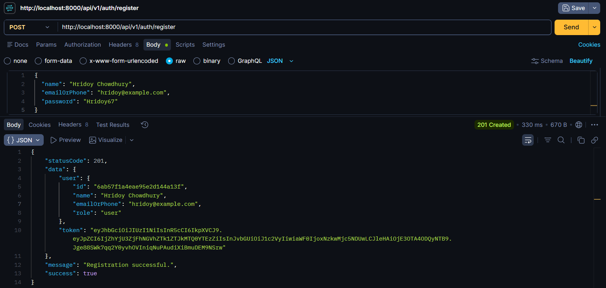
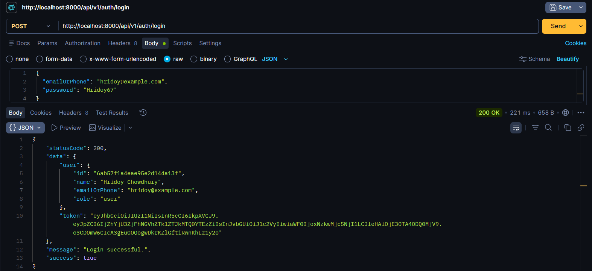
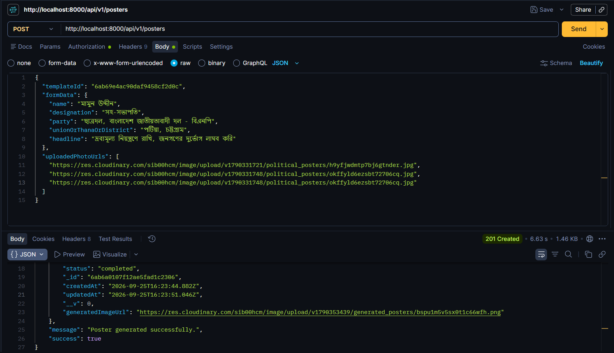
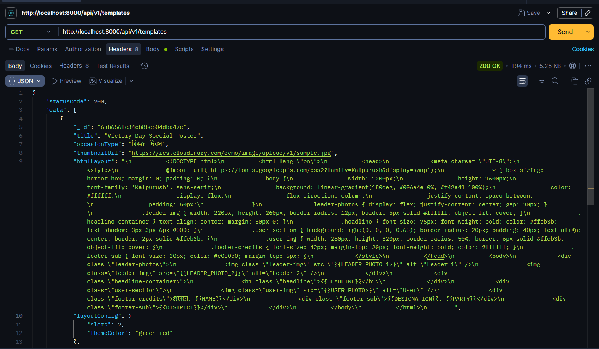
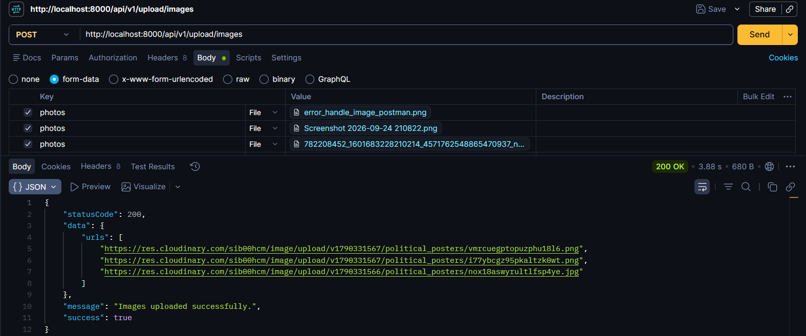
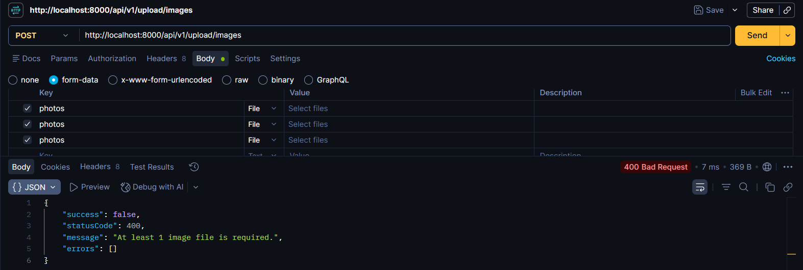
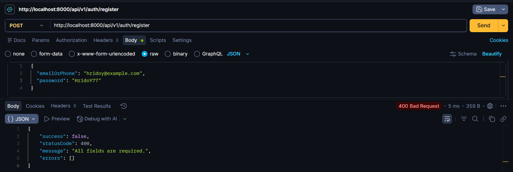
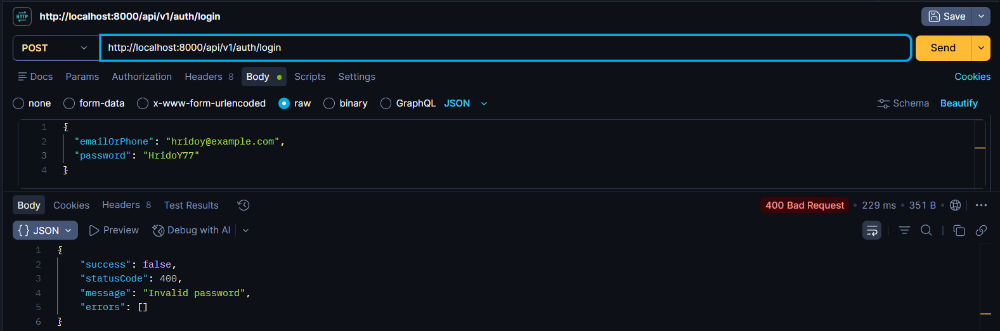

# 🔏 AI Political Poster Maker - Backend Server

> A robust, scalable, and secure backend architecture built with **Node.js, Express.js, TypeScript, and MongoDB (Mongoose)** designed to automate the generation of print-ready political posters tailored for Bangladeshi political campaigns, national days, and social movements.🚀

---

## 🌐 Project Links & Resources

* **Live Platform URL:** [https://banglaposter.infozia.site](https://banglaposter.infozia.site)
* **Frontend Repository:** [https://github.com/hridoy-web/bangla-poster-frontend](https://github.com/hridoy-web/bangla-poster-frontend)
* **Backend Repository:** [https://github.com/hridoy-web/political_poster_backend](https://github.com/hridoy-web/political_poster_backend)

---

## 🚀 Tech Stack & Core Dependencies

* **Runtime:** Node.js
* **Framework:** Express.js (with TypeScript)
* **Database & ODM:** MongoDB & Mongoose
* **Authentication:** JSON Web Tokens (JWT) & `bcrypt.js` for secure password hashing
* **File Handling:** Multer (Memory/Disk storage) & Cloudinary SDK
* **Rendering Engine:** Puppeteer (Server-side high-resolution image rendering)
* **Validation & Error Handling:** Custom AppError, ApiResponse, and AsyncHandler utilities

---

## 📁 Project Directory Structure

The backend follows an industry-standard MVC architecture optimized for maintainability and separation of concerns:

```text
political-poster-backend/
├── src/
│   ├── config/             # Configuration files (Database & Cloudinary)
│   │   ├── cloudinary.ts   # Cloudinary storage configuration
│   │   └── db.ts           # Mongoose MongoDB connection setup
│   │
│   ├── controllers/        # Request-response business logic handlers
│   │   ├── auth.controller.ts      # User registration, login & token issuance
│   │   ├── poster.controller.ts    # Poster generation, history, and deletion logic
│   │   ├── template.controller.ts  # Template management and retrieval
│   │   └── upload.controller.ts    # Media upload handling
│   │
│   ├── middlewares/        # Custom Express middleware functions
│   │   ├── auth.middleware.ts      # JWT verification & route protection
│   │   ├── error.middleware.ts     # Global centralized error handler
│   │   └── multer.middleware.ts    # Multipart/form-data file interception
│   │
│   ├── models/             # Mongoose database schemas & types
│   │   ├── User.ts         # User schema (Credentials, role, timestamps)
│   │   ├── Template.ts     # Poster layout template schema
│   │   └── Poster.ts       # Generated poster history & form data schema
│   │
│   ├── routes/             # Express API route endpoints
│   │   ├── auth.routes.ts      # Authentication endpoints (/api/auth)
│   │   ├── poster.routes.ts    # Poster generation endpoints (/api/posters)
│   │   ├── template.routes.ts  # Template listing endpoints (/api/templates)
│   │   └── upload.routes.ts    # Asset upload routes (/api/upload)
│   │
│   ├── seeds/              # Initial database seed scripts
│   │   └── templateSeed.ts # Preloaded default poster templates
│   │
│   ├── services/           # External service integrations
│   │   └── renderService.ts# Puppeteer-based server-side poster image rendering
│   │
│   ├── utils/              # Reusable helper classes & functions
│   │   ├── ApiError.ts     # Standardized operational error builder
│   │   ├── ApiResponse.ts  # Standardized success response constructor
│   │   ├── asyncHandler.ts # Higher-order wrapper to catch async errors
│   │   └── generateToken.ts# JWT token generator utility
│   │
│   ├── app.ts              # Express application configuration & middleware wiring
│   └── server.ts           # Entry point initiating database connection & HTTP server
│
├── .env                    # Environment variables (Port, DB URI, Secrets)
├── .gitignore              # Git ignore configuration
├── package.json            # Project dependencies and startup scripts
└── tsconfig.json           # TypeScript compiler configuration

```
## 📸 API Response & Testing Screenshots

API endpoint screenshots:

<table>
  <tr>
    <td align="center" width="50%">
      <b>1. User Registration Success</b><br><br>
      
    </td>
    <td align="center" width="50%">
      <b>2. User Login Success</b><br><br>
      
    </td>
  </tr>
  <tr>
    <td align="center" width="50%">
      <b>3. AI Poster Generation Success</b><br><br>
      
    </td>
    <td align="center" width="50%">
      <b>4. Get All Templates</b><br><br>
      
    </td>
  </tr>
  <tr>
    <td align="center" width="50%">
      <b>5. Cloudinary Upload Success</b><br><br>
      
    </td>
    <td align="center" width="50%">
      <b>6. Cloudinary Upload Error Response</b><br><br>
      
    </td>
  </tr>
  <tr>
    <td align="center" width="50%">
      <b>7. Error Handle Image</b><br><br>
      
    </td>
    <td align="center" width="50%">
      <b>8. Error Handle Postman</b><br><br>
      
    </td>
  </tr>
</table>

---
### 🔌 API Endpoints Reference

* **Authentication (`/api/v1/auth`)**
  * `POST /register`: Register a new user account.
  * `POST /login`: Authenticate user credentials and return a JWT token.

* **Posters (`/api/v1/posters`)**
  * `POST /`: Create a new poster request using form data and uploaded photos.
  * `GET /user/history`: Fetch the generation history of posters created by the logged-in user.
  * `POST /:id/regenerate`: Regenerate a specific poster record.
  * `DELETE /:id`: Delete a specific poster record.

* **Templates (`/api/v1/templates`)**
  * `GET /`: Retrieve a list of all curated poster templates.
  * `GET /:id`: Fetch detailed layout specifications for a specific template.

* **Upload (`/api/v1/upload`)**
  * `POST /images`: Upload up to 3 media assets to Cloudinary storage.
---

## 🛠️ Getting Started & Installation

Follow these steps to set up and run the backend server locally:

### 1. Clone the Repository

```bash
git clone https://github.com/hridoy-web/political_poster_backend.git
```
```bash
cd political_poster_backend
```

### 2. Install Dependencies

```bash
npm install
```

### 3. Configure Environment Variables

Create a `.env` file in the root directory and add the following keys:

```env
PORT=5000
MONGODB_URI=your_mongodb_connection_string
JWT_SECRET=your_jwt_secret_key
CLOUDINARY_CLOUD_NAME=your_cloud_name
CLOUDINARY_API_KEY=your_api_key
CLOUDINARY_API_SECRET=your_api_secret

```

### 4. Run the Development Server

```bash
npm run dev

```
